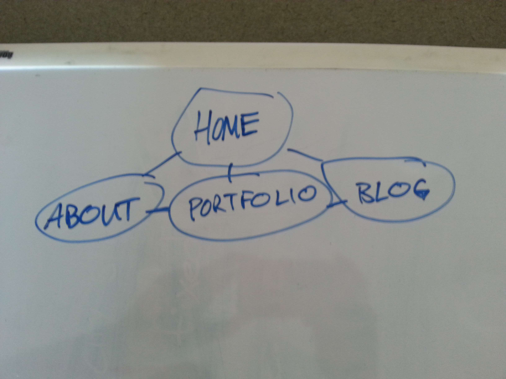

##1. What are the 6 Phases of Web Design?

1. Information gathering
2. Site planning
3. Design
4. Development
5. Testing
6. Maintenance

##2. What is your site's primary goal or purpose? What kind of content will your site feature?

The purpose of my website is to:

- showcase my design & development flavor & skill, and
- share information about me and help people get a sense of my personality (my values, my goals, my interests), and
- host my own technical blog

My site will contain the following kinds of content:

- my contact information (github/linkedin/twitter/email/contact form--basically my social presence)
- who I am (my values, my goodreads bookshelves, perhaps my goals, maybe my interests)
- examples of my work and skill (portfolio and github)
- my technical blog
- involvement in the community (meetups, blogs, github)
- maybe down the road my services & prices

##3. What is your target audience's interests and how do you see your site addressing them?

First, allow me to define my target audience. They are:

- individuals & businesses who need design & dev services
- HR managers
- Head hunters
- developers/designers, prospective developers/designers, potential collaborators

My target audience's interests are:

- finding great NEW candidates for jobs
- reseaching and learning about CURRENT job candidates
- connecting socially about jobs, training, and community building within the industry

##4. What is the primary "action" the user should take when coming to your site? Do you want them to search for information, contact you, or see your portfolio? It's ok to have several actions at once, or different actions for different kinds of visitors.

User's should, first and foremost, know my name and brand. They should also take the following actions:

- view my portfolio
- contact me
- read my blog
- view what books I am reading now and by bookshelves (goodreads)

##5. What are the main things someone should know about design and user experience?

Keep the end-user in mind when making any content, presenetation, or interaction decisions.

User experience (UX) is complex. Many factors influence UX--ergonomics, human-computer interface, accessibility, utility, design, usabiltiy, system performance.

UX is likely most valuable for complex systems.

UX does not meet *every single* user's needs. It does its best to "design for specific experiences and promote certain behaviors."[^fn-UX_reference]

UX is not the same as usability. Usability is a factor that informs or can impact UX.

Although the return on investment in UX is not easily measureable due to its largely qualitative nature, it is still extremely valuable. See my next answer for some of the reasons why this is so.

##6. What is user experience design and why is it valuable?

UX is *how a person feels* when *interfacing with a system*--be it a website, application, computer, phone etc.

Here are a few reasons why I think UX is extremely valuable. UX:

- makes it easy for users to take the actions you wish them to take
- makes a great impression on users
- inspires users to come back, spend money, continue using, if done well
- facilitates the accomplishment user's goals--which can influence their reputation of the system's owner(s) and contributors

UX is more important now than ever because users are so empowered by the accessibility of knowledge and the prevalence of affordable, diverse technology. This means users are becoming smarter and more aware of good UX vs. bad UX. Furthermore, they are more likely to be using a variety of  technology: tablets, desktops, very old mobile devices, smart phones & watches, vehicles etc. The website or app that does not cater to their target users' preferences, needs, and goals will quickly be passed over for a more conscious and considerate one.

##7. Which parts of the challenge did you find tedious?

Information gatherig took me some time. I had to rewrite my answers several times. Although this was tedious, I enjoyed the process of fleshing out the purpose for my site. I am a giant proponent of the motto, "Plan the work, work the plan," so I was happy to spend so much time on this initial phase.

[^fn-UX_reference]: [What Is User Experience Design? Overview, Tools And Resources](http://www.smashingmagazine.com/2010/10/what-is-user-experience-design-overview-tools-and-resources/)