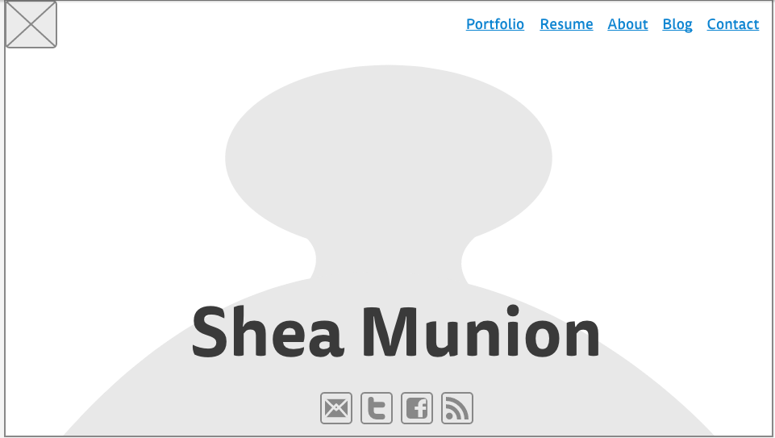
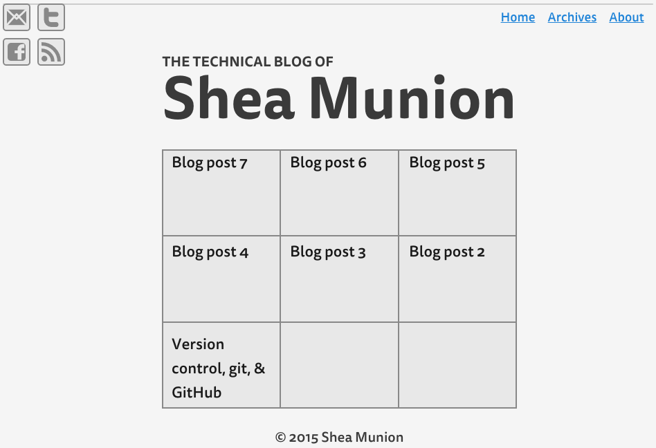
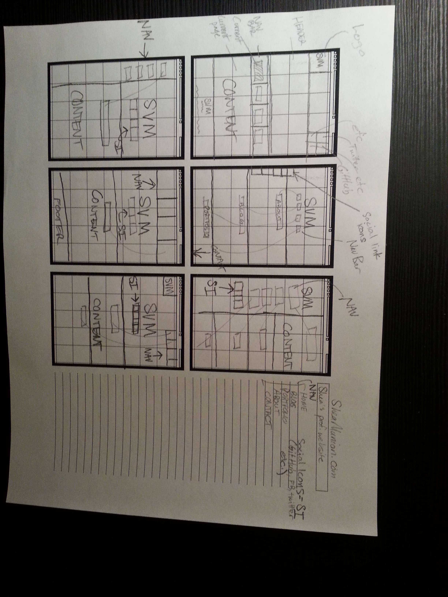
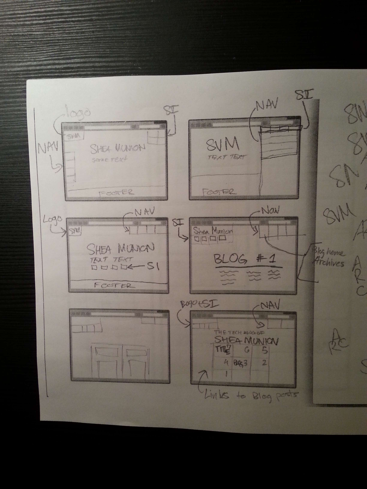

##1. What is a wireframe?

A wireframe is a sketch or mock-up of a website, application, or program. Wireframes can be really simple (i.e. a sketch using pen & paper) or more complex (digital, hi-def images). Some wireframes may even display interactivity. Essentially, though, wireframes are visual guides, like blueprints, that show us what a final product will look like.

##2. What are the benefits of wireframing?

Wireframing allows us to create numerous design possibilities very quickly and cheaply. We can rapidly produce different prototypes and garner feedback from others quite simply. Because of their fluid nature, we can change wireframes quickly. Furthermore, wireframes are like blueprints. Wireframes make it easier to code because you know what you're building and why.

##3. Did you enjoy wireframing your site?

YES! I enjoyed the process so much. I am absolutely NOT a designer nor an artist. I DO NOT consider myself artistic. But, as was written in one of the required reading articles, people like me may have an easier time wireframing. I began with sketching thumbnails. This was definitely challenging to start but I kept at it and just committed to putting my pencil on the paper. I had to stop judging my ideas as I had them and just sketch. Once I had settled on my preferred layout, I built the wireframe using mockingbird. This whole challenge was quite enjoyable. I like doing this stuff.

##4. Did you revise your wireframe or stick with your first idea?

I actually spent about 40 minutes sketching thumbnails. It was really helpful because I was able to see nine different designs on two pieces of paper and pick and choose my favorite elements. In fact, I included pictures of my thumbnails at the end of this post if you want to see what my process looked like. Anyways, I think that I didn't revise my digital wireframe because I had gone through the initial thumbnail sketches first.

##5. What questions did you ask during this challenge? What resources did you find to help you answer them?

I had questions like, how do I start wireframing? What tools do I use? How detailed should my wireframes be? How do professionals approach this task?

To be honest, I found my answers in the required reading and optional reading in Release 0. In particular, I found the pen & paper thumbnail sketching approach really useful. It was also a fresh excercise for me because I do not sketch anything often.

##6. Which parts of the challenge did you enjoy and which parts did you find tedious?

I really enjoyed exploring other people's and companies' websites and blogs to gain inspiration. We can do *so many* different things with these tools and create *so many* different experiences and designs. It is really exciting to consider the possibilities. I enjoyed sketching thumbnails of wireframes. I also enjoyed creating my current wireframe in mockingbird. Of course, the final step of creating the digital wireframe in mockingbird got somewhat tedious just because I had to move so many elements and rename and resize each of them before I was happy with the result.

