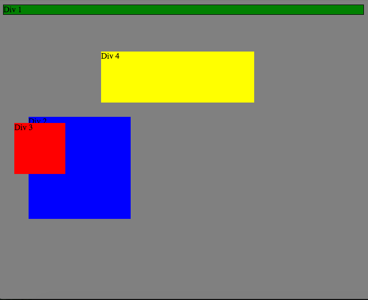
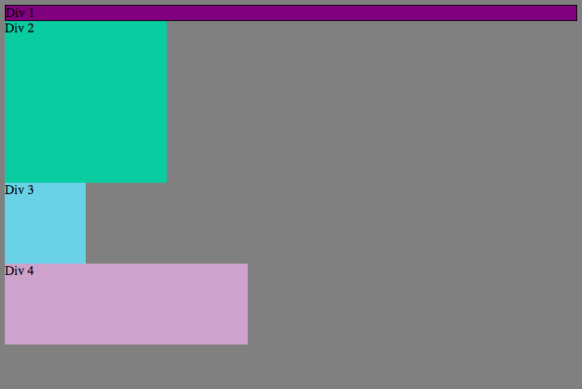
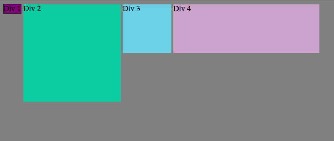
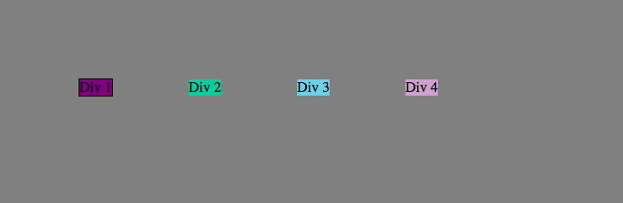
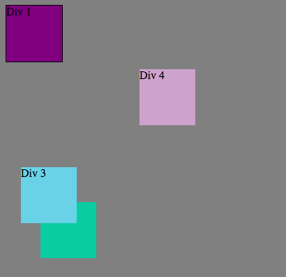
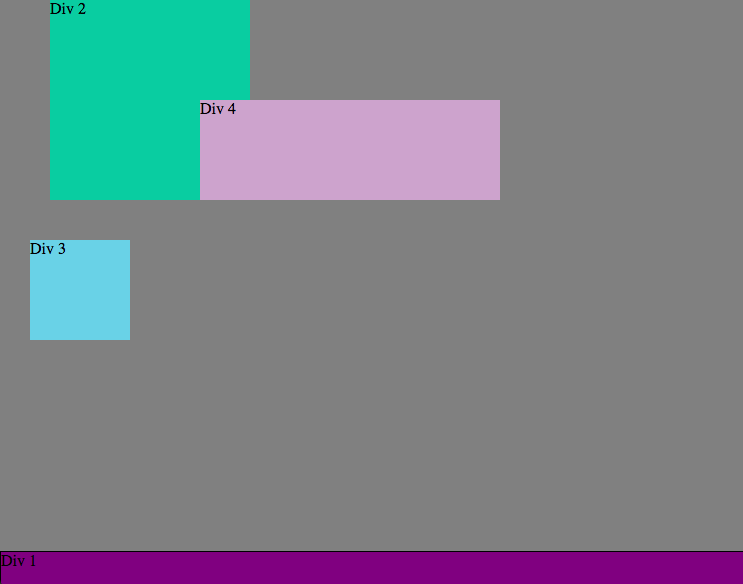
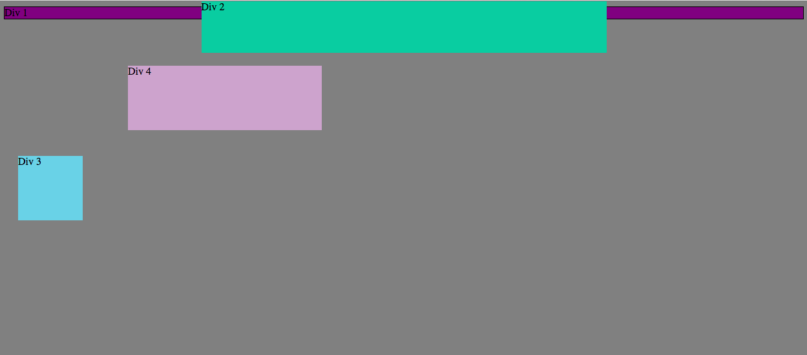
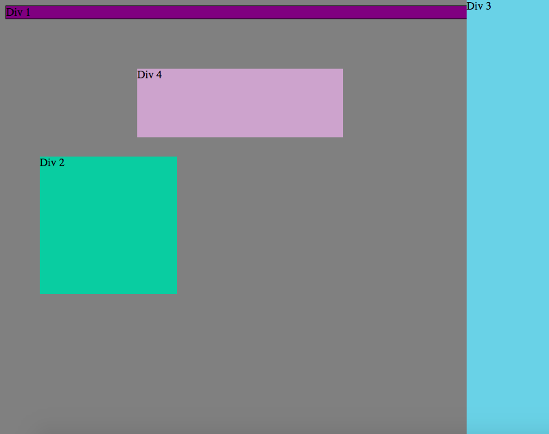

#Positioning Reflection
###***Note: screenshots from challenge are at the end of this reflection***

##1. How can you use Chrome's DevTools inspector to help you format or position elements?

It's real simple! Just open the DevTools using the menu bar, short cut, or right-clicking on the page and choosing "Inspect Element." Once it's open, you can manually change CSS properties in the editor. Furthermore, you can mouse over specific elements on a page and DevTool's will "paint" the margins and content dimensions.

##2. How can you resize elements on the DOM using CSS?

We can change the values of the following properties:

- <code>height</code>
- <code>width</code>
- <code>margin</code>
- <code>border</code>
- <code>padding</code>

##3. What are the differences between Absolute, Fixed, Static, and Relative positioning? Which did you find easiest to use? Which was most difficult?

##4. What are the differences between Margin, Border, and Padding?

##5. What was your impression of this challenge overall? (love, hate, and why?)

I really enjoyed this challenge! Let me be clear, positioning with CSS is one of the most challenging skills I have learned so far this phase. But, I know that the only way to overcome challenges is by facing them head on. If I don't actually practice positioning with CSS, my practical understanding of positionging will never reach the level I need it to be. That is why I enjoyed this challenge. While a few exercises were particluarly elusive (3 and 4), I learned the most from them as we solved them.

##Background Colors

##Column

##Row

##Equisdistant

##Squares

##Footer

##Header

##Sidebar

