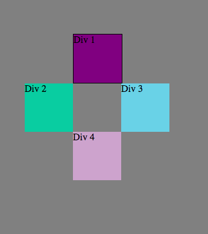

#Positioning Reflection
###***Note: screenshots from challenge are at the end of this reflection***

##1. How can you use Chrome's DevTools inspector to help you format or position elements?

It's real simple! Just open the DevTools using the menu bar, short cut, or right-clicking on the page and choosing "Inspect Element." Once it's open, you can manually change CSS properties in the editor. Furthermore, you can mouse over specific elements on a page and DevTool's will "paint" the margins and content dimensions.

##2. How can you resize elements on the DOM using CSS?

We can change the values of the following properties:

- <code>height</code>
- <code>width</code>
- <code>margin</code>
- <code>border</code>
- <code>padding</code>

##3. What are the differences between Absolute, Fixed, Static, and Relative positioning? Which did you find easiest to use? Which was most difficult?

Absolute: positions an element relative to it's first parent that has a position value that is *not* <code>static</code>.

Fixed: positions an element relative to the browser window. i.e. a <code>fixed</code> element that is <code>left: 20px;</code> will place the element 20px from the left side of the browser.

Static: this is the default position for elements. Elements with this <code>position</code> value appear as they would normally in the document flow.

Relative: poitions an element relative to *its original* place in the document flow.

I found absolute to be somewhat challenging simply because it doesn't feel intuitive to me. It requires me to know which parent elements are not static.

Of couse, static is easy to use. But, after that, I think fixed is easier than relative or absolute because it has an easy to find reference point--the browser window!

##4. What are the differences between Margin, Border, and Padding?

Margin: defines the space around an element, surrounding the border, padding and content. It is not visible.

Border: defines the space between the margin and the padding. It can be visible.

Padding: defines the space between the padding and the content of the element. It will dispaly the backgroudn color of the element.

##5. What was your impression of this challenge overall? (love, hate, and why?)

I really enjoyed this challenge! Let me be clear, positioning with CSS is one of the most challenging skills I have learned so far this phase. But, I know that the only way to overcome challenges is by facing them head on. If I don't actually practice positioning with CSS, my practical understanding of positionging will never reach the level I need it to be. That is why I enjoyed this challenge. While a few exercises were particluarly elusive (3 and 4), I learned the most from them as we solved them.

##Background Colors

##Column

##Row

##Equisdistant

##Squares

##Footer

##Header

##Sidebar

##Tic-tac-toe

