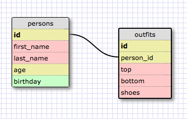

#Introduction to Database Schemas and SQL

##Release 5: SELECTing data from a database

1. SELECT * FROM states;

2. SELECT * FROM regions;

3. SELECT state_name,population FROM states;

4. SELECT state_name,population
   ...> FROM states
   ...> ORDER BY population DESC;

5. SELECT state_name FROM states WHERE region_id = 7;

6. SELECT state_name,population_density
   ...> FROM states
   ...> WHERE population_density > 50
   ...> ORDER BY population_density ASC;

7. SELECT state_name
   ...> FROM states
   ...> WHERE population > 1000000 AND population < 1500000;

8. SELECT state_name,region_id
   ...> FROM states
   ...> ORDER BY region_id ASC;

9. SELECT region_name
   ...> FROM regions
   ...> WHERE region_name
   ...> LIKE '%Central';

10. SELECT regions.region_name,states.state_name
   ...> FROM regions
   ...> INNER JOIN states
   ...> ON regions.id=states.region_id
   ...> ORDER BY region_id ASC;

##Release 6. My Own Schema

##Release 7. Reflection

###1. What are databases for?

Databases are great ways to store collections of data such that  data can be added, retrieved, and modified. They are generally more powerful than other collections like hashes or arrays. Databases are optimized for storing and managing vast amounts of data on a scale that would render hashes and arrays uselessly complex.

Some databases are relational and are called Relational Database Management Systems or RDBMS. Here is a very helpful [comparison between non-relational and relational databases](http://i.stack.imgur.com/YxFdC.png).

###2. What is a one-to-many relationship?

A one-to-many relationship describes a particular relationship between two different objects where one of the objects applies to many of the other objects. A simple way to test whether a one-to-many relationship exists is to complete the blanks in this sentence: "____ belongs to a ____. ____ has many ____." For example, let's define the relationship between books and libraries.
"Old Man and The Sea" belongs to the North Central library. The North Central library has many books. (Let's assume that there is only one copy of each book. Therefore, a book can only be in one library at any given time.)

###3. What is a primary key? What is a foreign key? How can you determine which is which?

A primary key is the unique identifier for each row in a table (e.g., Table 1). A foreign key is the identifier in the same table (e.g., Table 1) that links to the primary key of a related table (e.g., Table 2).

The primary key in a table will always have unique values. The foregin key in the table may not be unique. Furthermore, the foreign key in the table will be the primary key of a related table.

###4. How can you select information out of a SQL database? What are some general guidelines for that?

We use write queries to select information from SQL databases. SQL queries follow specifc syntax and uses keywords. Usually, a query begins with the SELECT keyword followed by the field(s) desired. This is followed by the FROM keyword and the name of the table where the fields are located. After that, queries can become more specific and complex, leveraging conditions, joining fields from two or more tables, etc.