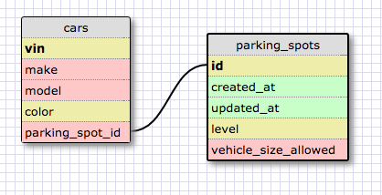
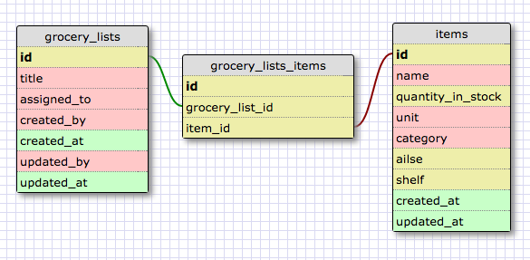

#8.5 More Schemas

##Release 2: Create a One-to-one Schema

Each car in a parking lot may be assigned to only one parking spot at any time. Likewise, each parking spot may have only one car in it at any time. We will never allow two cars to be parked in one spot--physically, we couldn't fit them--and we will never allow one car to be parked in two different spots--what a waste of space!

##Release 4: Refactor

##Release 6: Reflect

###1. What is a one-to-one database?

This is when instances of entities may only be grouped in pairs.

###2. When would you use a one-to-one database? (Think generally, not in terms of the example you created).

In general, a one-to-one relationship is useful when instances of different entities are best associated in unique pairs. When an instance of entity 1 is paired with an instance of entity 2, neither can be paired again while that relationship exists. One example is wives and husbands (assuming a monogomist society). A wife can only be paired with one husband and vice versa. Another example is buses and drivers. A driver can only operate one bus at a time, and any bus can only be operated by one driver. (Of course, the relationship between these two entities can be defined to represent one-to-many or many-to-many relationships.)

###3. What is a many-to-many database?

This is when an instance of one object can be related to two or more instances of another object, and vice versa. product1 can be related to order1 and order2. order1 can be related to product1 and product2.

###4. When would you use a many-to-many database? (Think generally, not in terms of the example you created).

In general, a many-to-many relationship is useful when the limit on the number of relationships between instances of different entities is greater than one in both directions.

###5. What is confusing about database schemas? What makes sense?

Choosing an appropriate relationship between tables is the most confusing aspect of DB schemas. Most everything else makes sense: conventions, field types, types of relationships, etc.